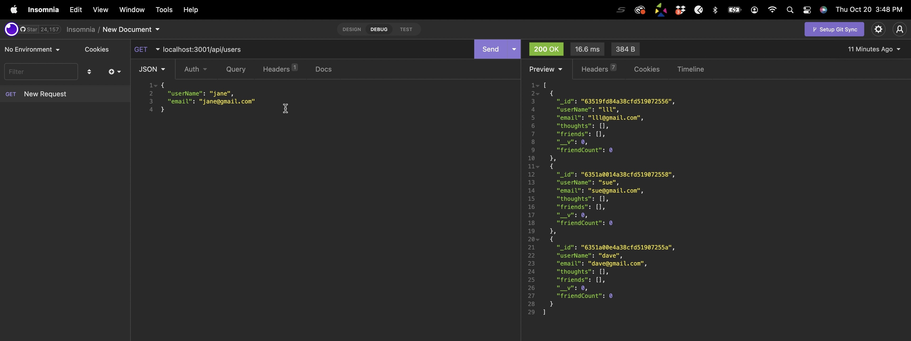
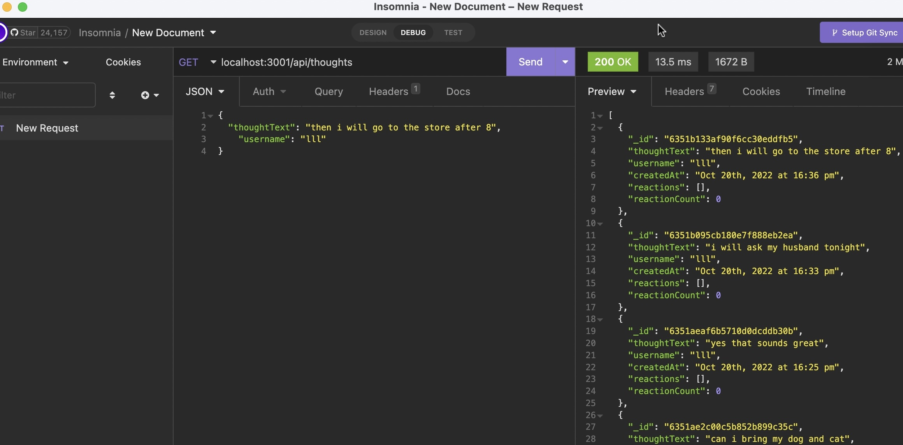

# MongoDB-Challenge18

## Table of Contents:
* [General Information](#general)
* [Installation Instructions](#installation)
* [Technologies](#technologies)
* [Credits](#credits)
* [License](#license)

### General Information:
This API is a social network web application where users can share their thoughts, react to friends' thoughts, and create a friend list. It uses Express.js for routing, a MongoDB database, and the Mongoose ODM.

### Installation Instructions:
Clone the repository listed at the bottom of this Readme file.  Make sure you have MongoDB installed.
Run: npm install i
Run: npm start
### Technologies:
JavaScript, NodeJS, NPM, Express, MongoDB, Mongoose

### Credits:
*

### Screenshots or Video Files:

* Google drive link to a video of the User Routes demonstration of this project:

* Google drive link to a video of the Thoughts Routes demonstration of this project:

### License
This project is licensed under:
License for this project is MIT

#### Footer:
This project was developed by:
Lindsay L Libhart
Libhartinc@gmail.com

This projects GitHub Repository is:
https://github.com/LibhartLL/MongoDB-Challenge18

The Developers GitHub is:
https://github.com/LibhartLL